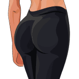

# Dynamic Option Visibility - Examples & Guide

## Overview
The quiz now supports showing different numbers of options for male vs female users. This is controlled by the `visibilityMap` configuration object.

---

## 🎯 Current Configuration

### Step 5 - Target Zones

**Male Users See (5 options):**
1. ✅ Arms
2. ✅ Pecs
3. ✅ Belly
4. ✅ Legs
5. ✅ Back

**Female Users See (4 options):**
1. ❌ Arms (hidden)
2. ✅ Chest
3. ✅ Belly
4. ✅ Legs
5. ✅ Back

---

## 🔧 How to Configure Visibility

Edit the `visibilityMap` object in `quiz-script.js`:

```javascript
const visibilityMap = {
    targetZones: {
        arms: ['male'],              // Only males
        pecs: ['male', 'female'],    // Both genders
        belly: ['male', 'female'],   // Both genders
        legs: ['male', 'female'],    // Both genders
        back: ['male', 'female']     // Both genders
    }
};
```

### Visibility Options:

| Value | Meaning |
|-------|---------|
| `['male']` | Only show for male users |
| `['female']` | Only show for female users |
| `['male', 'female']` | Show for both (default) |

---

## 📋 Example Scenarios

### Scenario 1: Gender-Specific Workout Goals

```javascript
visibilityMap: {
    dreamBody: {
        'few-sizes-smaller': ['male', 'female'],  // Both
        'athletic': ['male', 'female'],           // Both
        'shredded': ['male'],                     // Male only
        'swole': ['male'],                        // Male only
        'toned': ['female'],                      // Female only
        'sculpted': ['female']                    // Female only
    }
}
```

**Result:**
- Males: 4 options (few-sizes-smaller, athletic, shredded, swole)
- Females: 4 options (few-sizes-smaller, athletic, toned, sculpted)

### Scenario 2: Different Body Type Options

```javascript
visibilityMap: {
    build: {
        slender: ['male', 'female'],     // Both
        medium: ['male', 'female'],      // Both
        stocky: ['male'],                // Male only
        muscular: ['male'],              // Male only
        curvy: ['female'],               // Female only
        petite: ['female']               // Female only
    }
}
```

**Result:**
- Males: 4 options
- Females: 4 different options

### Scenario 3: Asymmetric Options

```javascript
visibilityMap: {
    targetZones: {
        arms: ['male'],                  // Male only
        pecs: ['male'],                  // Male only
        chest: ['female'],               // Female only
        belly: ['male', 'female'],       // Both
        legs: ['male', 'female'],        // Both
        back: ['male', 'female'],        // Both
        glutes: ['female']               // Female only
    }
}
```

**Result:**
- Males: 5 options (arms, pecs, belly, legs, back)
- Females: 5 options (chest, belly, legs, back, glutes)

---

## 🎨 Complete Example: Step-by-Step

Let's add a new option that only females see:

### Step 1: Add to HTML (`quiz.html`)

```html
<label class="target-zone-option" data-value="glutes">
    <div class="target-zone-content">
        <div class="checkbox-container">
            <input type="checkbox" class="target-zone-checkbox">
            <div class="custom-checkbox"></div>
            <span class="target-zone-text">Glutes</span>
        </div>
        <div class="target-zone-image">
            
            <div class="target-indicator"></div>
        </div>
    </div>
</label>
```

### Step 2: Add Image Path (`imageMap`)

```javascript
imageMap: {
    targetZones: {
        // ... existing options ...
        glutes: {
            male: '../assets/glutes-male.webp',    // If males could see it
            female: '../assets/tonedButt.png'       // Female image
        }
    }
}
```

### Step 3: Add Text Label (`textMap`)

```javascript
textMap: {
    targetZones: {
        // ... existing options ...
        glutes: {
            male: 'Glutes',
            female: 'Glutes'
        }
    }
}
```

### Step 4: Set Visibility (`visibilityMap`)

```javascript
visibilityMap: {
    targetZones: {
        // ... existing options ...
        glutes: ['female']    // ← Only females see this!
    }
}
```

### Result:
- When **male** selects gender: "Glutes" option is hidden
- When **female** selects gender: "Glutes" option appears

---

## 🔄 How It Works Internally

1. **User selects gender** in Step 1
2. **`selectedGender`** variable is updated ('male' or 'female')
3. **`updateImagesForGender()`** is called:
   ```javascript
   // For each option:
   const shouldShow = visibilityMap.targetZones['arms'].includes('female');
   if (!shouldShow) {
       option.style.display = 'none';  // Hide it
       option.classList.remove('selected');  // Deselect if was selected
   }
   ```
4. **Hidden options** don't count toward validation
5. **User navigates** - visibility persists across all navigation

---

## ⚠️ Important Notes

### Auto-Deselection
If a user somehow had an option selected and it gets hidden (shouldn't happen normally), the system automatically:
- Removes the `selected` class
- Unchecks the checkbox
- Removes it from `quizData.targetZones` array

### Validation
The system only validates visible options, so:
- Males need to select from their 5 visible options
- Females need to select from their 4 visible options

### Styling
Hidden options use `display: none`, so they:
- Don't take up space in the layout
- Can't be clicked or interacted with
- Don't appear in the DOM inspector as visible

---

## 🧪 Testing Checklist

- [ ] Select Male → Check Step 3, 4, 5, 6 options
- [ ] Select Female → Check Step 3, 4, 5, 6 options
- [ ] Verify correct number of options for each gender
- [ ] Go back to Step 1, change gender → Options update
- [ ] Try to submit Step 5 with no selections → Validation works
- [ ] Select options, change gender → Previous selections cleared if hidden
- [ ] Navigate back/forth → Visibility persists correctly

---

## 📊 Benefits

✅ **Personalized Experience** - Each gender sees relevant options only
✅ **Cleaner UI** - No irrelevant clutter
✅ **Better UX** - Users don't waste time on options that don't apply
✅ **Flexible** - Easy to add/remove options per gender
✅ **Scalable** - Can apply to any step (3, 4, 5, or 6)
✅ **Safe** - Auto-deselects hidden options to prevent data issues

---

## 🚀 Quick Reference

Want to hide an option? Add this:

```javascript
visibilityMap: {
    targetZones: {
        optionName: ['male']  // or ['female'] or ['male', 'female']
    }
}
```

That's it! The system handles the rest automatically.
